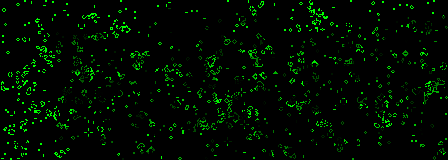

# pixel-receiver-rs

An emulator for the CCCB airport display. 

In CCCB, there is a big LED matrix screen you can send images to via UDP. 
This project aims to build a working an application that can receive packages in the same binary format and display the contents to the user.

Use cases:
- getting error messages for invalid packages
- test your project when outside CCCB
- test your project while other people are using the display

Uses the [servicepoint](https://github.com/cccb/servicepoint) library for reading the packets. Currently only works with my [fork](https://github.com/kaesaecracker/servicepoint).
The screenshot above shows the output of two example projects running in parallel (game_of_life and random_brightness).

## Running

Check out this repository and run `cargo run --release`.

## Command line arguments

The application binds to `0.0.0.0:2342` by default (`./pixel-receiver-rs --bind host:port` to change this).

See [env_logger](https://docs.rs/env_logger/latest/env_logger/) to configure logging.

Because this program renders to an RGB pixel buffer, you can enjoy the following additional features not available on the real display:

- enable or disable the empty space between tile rows (`./pixel-receiver-rs --spacers` to enable)
- render pixels in red, green, blue or a combination of the three (`./pixel-receiver-rs -rgb` for white pixels)

## Contributing

Contributions are accepted in any form (issues, documentation, feature requests, code, reviews, ...).

All creatures welcome.

## Legal stuff

The included font is https://int10h.org/oldschool-pc-fonts/fontlist/font?ibm_bios (included in the download from https://int10h.org/oldschool-pc-fonts/download/). The font is CC BY-SA 4.0.

For everything else see the LICENSE file.
